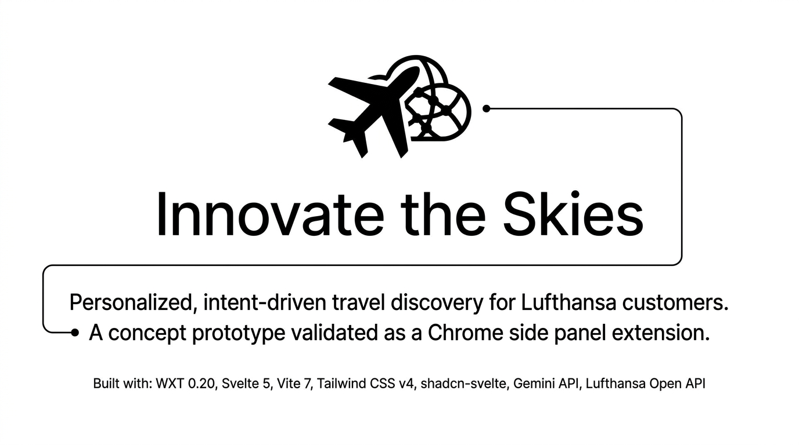

# Innovate the Skies



> Built during **Hamburg Hackathon: Innovate the Skies & Beyond** by [Social Developers Club](https://socialdevelopersclub.de/)

A prototype demonstrating personalized, intent-driven travel discovery for Lufthansa customers. Built as a Chrome side panel extension to validate the concept end-to-end — the interaction patterns, AI pipeline, and booking flow are designed to be embedded directly into Lufthansa's web properties and native apps once real user analytics infrastructure is in place.

## Concept

The core hypothesis is that implicit browsing signals — the destinations, articles, and experiences a user lingers on — are stronger predictors of travel intent than explicit search queries. This demo captures hover interactions on the Lufthansa Explore pages, builds a preference profile in real time, and uses that profile to drive a fully personalized event-and-flight recommendation pipeline without any explicit user input beyond setting a travel window.

In a production integration, this signal layer would be replaced by Lufthansa's existing analytics stack (session data, loyalty programme history, past booking behaviour). The AI recommendation and booking flow remain the same.

## How It Works

**Interest collection.** A content script runs on `lufthansa.com` and records hover events on destination cards and article content. Each interaction is stored locally with a frequency counter and timestamps. The side panel surfaces these interests as chips and can generate a natural-language traveler profile summary via the Gemini API.

**Event recommendation pipeline.** When the user triggers discovery, the background service worker reads the top interests from local storage, optionally applies a date-range filter, and fires three parallel requests to the Gemini API. Each request asks the model to return a real-world event (concert, festival, sports fixture, cultural event) that matches the interest profile and falls within the travel window, paired with the nearest Lufthansa-served airport.

**Flight lookup.** Once the user selects an event, the background fetches a live OAuth token from the Lufthansa Open API and queries the `/operations/scheduledflight` endpoint for FRA departures to the destination airport on the recommended flight date. The returned schedule data is parsed into flight options with leg-level detail (flight number, origin, destination, departure/arrival times, terminal).

**Booking handoff.** The selected flight is presented as a boarding-pass-style confirmation screen with estimated pricing. The final action opens the Lufthansa booking flow in a new tab. Price estimation is illustrative in this demo; a production integration would call a live fare pricing endpoint.

## Tech Stack

- **WXT 0.20** — browser extension framework, Chrome MV3, Side Panel API
- **Svelte 5** — reactive UI with runes (`$state`, `$derived`, `$effect`)
- **Vite 7** — build tooling (required for `@sveltejs/vite-plugin-svelte` v6 compatibility)
- **Tailwind CSS v4** — utility styling via `@tailwindcss/vite`
- **shadcn-svelte** — accessible component primitives (bits-ui, tailwind-variants)
- **Gemini API** — event recommendation and interest summarisation
- **Lufthansa Open API** — scheduled flight data, OAuth 2.0 client credentials

## Development

```bash
pnpm install
pnpm dev     # starts WXT dev server with HMR
pnpm build   # production build
pnpm zip     # packages extension for distribution
```

## Roadmap to Production Integration

The demo validates the UX and AI pipeline in isolation. Moving this into a real Lufthansa surface requires:

1. Replace the hover-tracking content script with a feed from the existing analytics pipeline (e.g. Adobe Analytics events, loyalty app session data).
2. Swap estimated prices for live fare data via the Lufthansa NDC or partner pricing API.
3. Migrate the Gemini calls to a backend service so API keys are not bundled client-side.
4. Integrate the booking handoff directly into the Lufthansa booking engine rather than a redirect.
